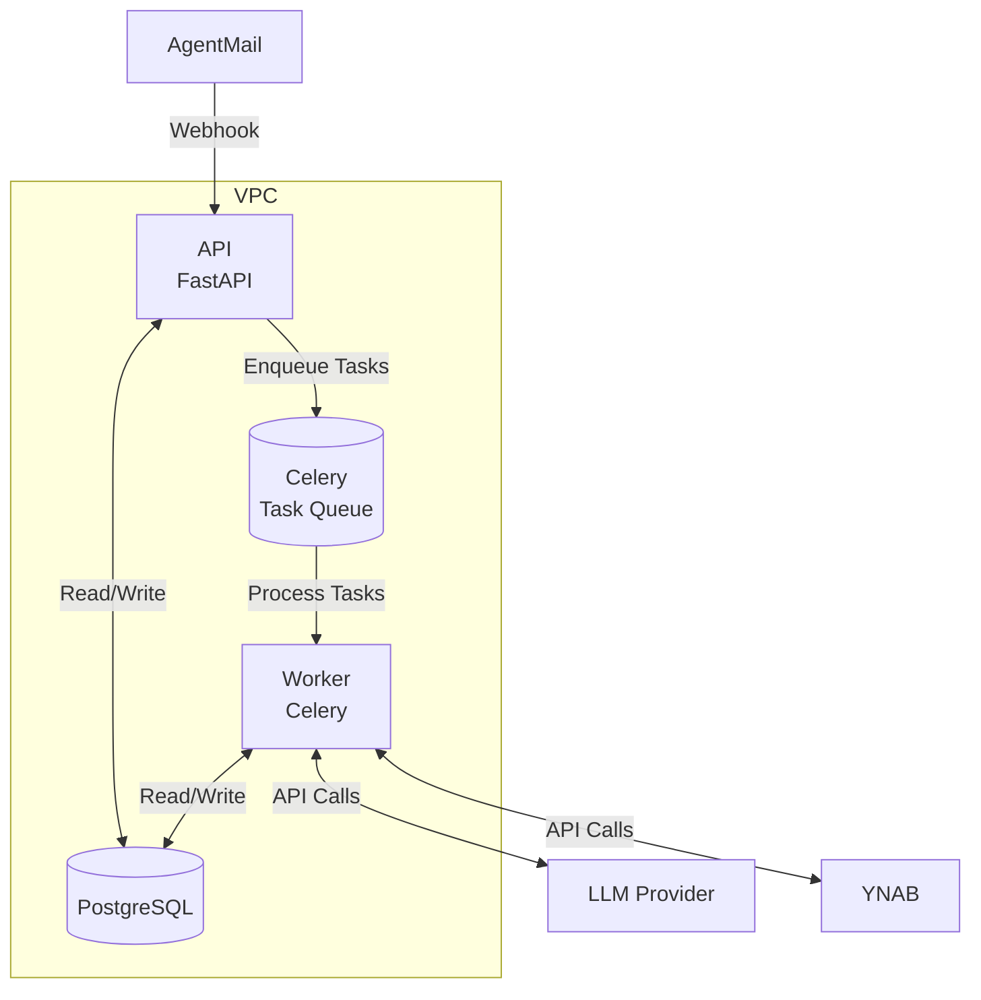

# Financial Categorizer

This is a financial categorizer that looks at transaction data (from YNAB) and categorizes the transaction based on various traits including:
- The categorizations of other transactions from said payee historically

## Features to Implement
- [ ] Suggestion by external LLM model to categorize a payee based off of a web search
- [ ] Add email listener (using Google's Gmail API) to categorize order based off of items (think: Ramp)

## Architecture

