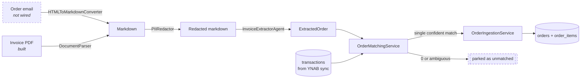
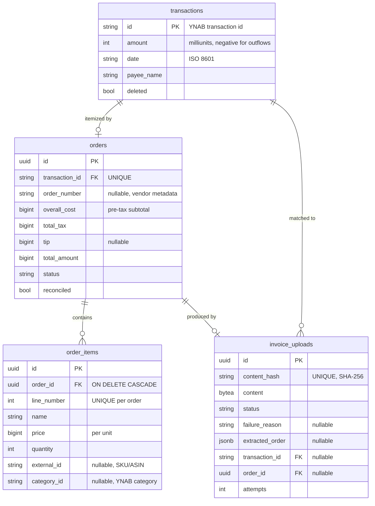
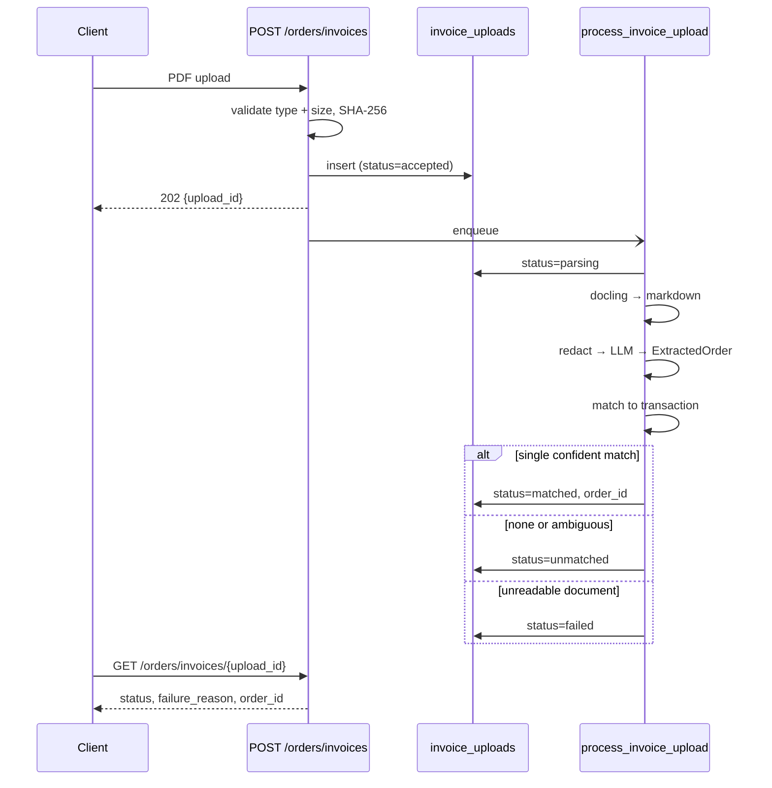
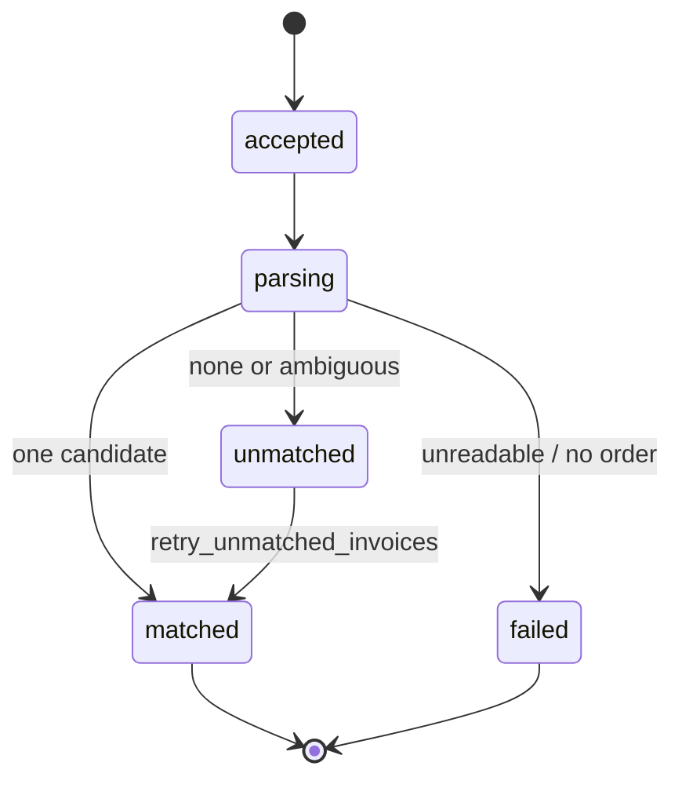

# Architecture

How an order gets into the database.

## 1. Purpose

A transaction arrives from the bank as a single opaque amount: `AMZN Mktp US*RT4G91YT3, -$31.98`. That is all YNAB knows, and it is not enough to categorize spending — one charge routinely covers groceries, a gift, and a household item.

Itemizing that charge is what this system does. Once a transaction has line items, the charge can be **split across categories** in YNAB, with each line assigned its own category.

The itemization comes from an **Invoice**, which per [`GLOSSARY.md`](../GLOSSARY.md) is *"either a HTML email or PDF"*. That definition is the reason this document describes one pipeline rather than two: the entry points differ, everything downstream is shared.

> **Status:** the PDF-upload path is built. The email path is designed but **not wired** — see [§5](#5-path-b--order-email-not-wired).

## 2. The shared spine

Both entry points converge on the same sequence: reach markdown, redact, extract, match, write.



The seams that make the second path cheap to add:

| Seam | Interface | Role |
|---|---|---|
| Reach markdown | `DocumentParser` (`src/interfaces/document_parser.py`)<br/>`HTMLToMarkdownConverter` (`src/interfaces/html_to_markdown_converter.py`) | The only part that differs per entry point |
| Redact | `PIIRedactor` (`src/interfaces/pii_redactor.py`) | Shared, mandatory, runs immediately before the model call |
| Converge | `ExtractedOrder` (`src/models/order.py`) | The type both paths produce |
| Match | `OrderMatchingService` (`src/services/order_matching_service.py`) | Path-agnostic |
| Write | `OrderIngestionService` (`src/services/order_ingestion_service.py`) | Path-agnostic; the only place an order is written |

`ExtractedOrder` deliberately has **no `transaction_id`** — extraction happens before matching, and an order that has been read off a document but not yet attached to a charge is a real, valid state. `Order.from_extracted` promotes it once a transaction is known.

## 3. Data model



Defined in `src/models/orm.py`. Invariants that the column names do not convey:

- **`orders.transaction_id` is `UNIQUE`.** One posted card charge is one order. A vendor order split across three shipments bills as three charges and therefore becomes three orders — `order_number` repeats across them, which is why it is metadata rather than part of the key.
- **Money is integer milliunits throughout** (`$15.99` → `15990`), matching YNAB. YNAB records outflows as **negative**; invoice totals are positive. Every comparison between the two uses `abs()`.
- **`order_items.price` is the price of one unit.** The line total is `price × quantity`.
- **`invoice_uploads.content_hash` is the accept-time idempotency key.** The transaction an invoice belongs to is unknown at upload time, so the file's SHA-256 is what makes re-uploading a no-op.
- **`order_items.category_id` survives re-ingest.** Line items are delete-and-replace, so `OrderPostgresRepo._existing_categories` carries categories forward, matching on `external_id` first and `name` second.
- Every table carries `created_at` / `updated_at` per [`CLAUDE.md`](../CLAUDE.md).

## 4. Path A — invoice upload (built)

Upload is fire-and-forget. The response confirms acceptance and nothing more, so the `invoice_uploads` row is the only record of what happened.



| Component | File |
|---|---|
| Routes | `src/routes/orders.py` |
| Task | `src/tasks/invoice_tasks.py` |
| PDF → markdown | `src/adapters/docling_document_parser.py` |
| Redact + extract | `src/agents/invoice_extractor_agent.py` |
| Upload persistence | `src/repos/invoice_upload_postgres_repo.py` |
| Order persistence | `src/repos/order_postgres_repo.py` |

### Upload lifecycle



Defined by `InvoiceUploadStatus` in `src/models/invoice.py`. Two policies here are easy to reverse by accident later:

**A bad PDF is terminal.** A document that cannot be read, or that yields no order, lands in `failed` and is never retried — retrying an unusable document only spends money against the LLM provider. Only infrastructure failures (provider outage, database blip) go through Celery's retry.

**Ambiguity is never resolved by guessing.** Zero candidates and multiple candidates both park as `unmatched`. Zero is entirely normal: an invoice uploaded the day of purchase precedes its charge by days. `retry_unmatched_invoices` re-runs matching after each YNAB sync, reusing the stored `extracted_order` so extraction never repeats. A *wrong* attachment, by contrast, is silent and near-impossible to detect afterwards — which is why the top-ranked-candidate shortcut is deliberately not taken.

## 5. Path B — order email (not wired)

### Target design

Nylas webhook → fetch the message by id → HTML → markdown → **the same spine from [§2](#2-the-shared-spine)**. Matching, reconciliation and persistence need no changes; only the "reach markdown" seam differs.

### Current state

| Component | File | Status |
|---|---|---|
| Nylas webhook route | `src/routes/emails.py` | Exists; `create_email_routes()` is **never called**, so nothing is mounted |
| `process_email` task | `src/tasks/email_tasks.py` | **Fails to import** — imports `EmailProcessor`, the class is `EmailProcessorAgent` |
| `EmailProcessorAgent` | `src/agents/email_processor.py` | Stub; `process_email_content` returns `None` |
| `EmailRouter` | `src/services/email_router.py` | `pass` |
| `EmailIngestionService` | `src/services/email_ingestion_service.py` | Returns `[]` |
| Fetch-by-id | `src/clients/nylas_client.py` | Missing — the webhook carries only a message id, and `EmailSearcher` exposes only `search_emails` |

`src/entrypoints/api.py` registers `health_router` and `orders_router` only.

### Why this path is hard

These were found against the real corpus in `parsed_messages/` (29 senders). They are the reason email was deferred rather than shipped alongside the upload path.

**Amazon hides the item names.** `auto-confirm@amazon.com` renders every product as `Item hidden for privacy`. The only surviving identifier is the ASIN inside a click-tracking URL — so an Amazon order email cannot be itemized at all, and the redactor must not strip URLs if the ASIN is to survive.

**Nested layout tables destroy receipts.** The Toast receipt is 23,907 bytes of HTML containing 8 line items, a subtotal, two taxes and a total. Both existing converters emit **553 bytes**: a phone number, a privacy link, and a copyright notice. The receipt sits three layout-tables deep, and markdown pipe tables cannot nest, so the inner content is dropped. Unwrapping `table`/`tr`/`td` to `<div>` before conversion recovers all of it — 553 → **2,859 bytes**, every item, both taxes, and the `$69.54` total (the eight item prices sum to the stated `$65.00` subtotal).

**MSO conditional comments duplicate every item.** Amazon ships an `<!--[if mso]>` block and a non-MSO block, so each product appears twice. Unstripped, a two-unit order reads as two separate line items and doubles.

**Prices are split across DOM nodes.** Amazon renders `$15.99` as `<sup>$</sup>`, `15`, `<sup>99</sup>`. Any converter concatenates that to `$1599`. Left unhandled, `$15.99` can be stored as 1,599,000 milliunits.

**The converter choice matters.** `TrafilaturaHTMLToMarkdownClient` wraps an article-extraction library built to pull the body out of a news page — exactly the wrong shape for a receipt, whose content lives in the tables trafilatura discards. `HTMLToMarkdownClient` plus a preprocessor handling the three issues above is the path forward.

## 6. Cross-cutting concerns

### PII redaction

Redaction runs **inside** `InvoiceExtractorAgent.extract`, immediately before the model call, so no caller can route unredacted document text to an external provider.

Redacted (`src/adapters/presidio_pii_redactor.py`): `CREDIT_CARD`, `CRYPTO`, `EMAIL_ADDRESS`, `IBAN_CODE`, `IP_ADDRESS`, `PHONE_NUMBER`, `US_BANK_NUMBER`, `US_DRIVER_LICENSE`, `US_ITIN`, `US_PASSPORT`, `US_SSN`.

**Not** redacted, deliberately: `PERSON`, `LOCATION`, `NRP`, `URL`.

Presidio's NER cannot distinguish a customer name from a product name. Against the Toast receipt it flags `Ham Jamboree`, `American Classic` and `French Toast Four Pack` — redacting those destroys the line items the pipeline exists to extract. `URL` redaction additionally strips vendor item identifiers such as an Amazon ASIN. The trade-off accepted here is that the account holder's own name may reach the provider; the identifiers that actually matter — card numbers, SSNs, bank details — do not.

### Reconciliation

```
sum(price × quantity) + total_tax + tip  ==  abs(transaction.amount)
```

Computed by `OrderIngestionService.reconciles`. Failing it sets `reconciled = false`; **the order is still written**, because partial data is worth keeping. Downstream categorization must skip unreconciled orders rather than push a YNAB split whose sub-amounts do not sum to the transaction — YNAB rejects those, and a silently wrong split is worse than none.

### How transactions arrive

`sync_ynab_transactions` runs every six hours (`crontab(minute=0, hour="*/6")`, `src/config.py`) and calls `SyncService.sync_transactions`, which pulls incrementally using YNAB's `last_knowledge_of_server` and upserts into `transactions`. On success it enqueues `retry_unmatched_invoices`.

This cadence is why an invoice legitimately arrives before its charge, and why `unmatched` is a routine state rather than an error.

## 7. Status summary

| Capability | State |
|---|---|
| Invoice PDF upload → order | Built |
| Transaction matching + retry | Built |
| Reconciliation flag | Built |
| Category preservation across re-ingest | Built |
| Narrowed PII redaction | Built |
| Order email → order | **Not wired** |
| Email HTML preprocessing | **Not built** |

## 8. Deferred

- **Amazon multi-shipment invoices.** Amazon's "Final Details for Order" invoice is organized per shipment, each block with its own charge — so one PDF legitimately means N orders. The upload path assumes one PDF is one order.
- **Ingestion source and precedence.** Once email lands, two paths can write the same `orders` row, and email data is lower fidelity than PDF data (`<REDACTED_URL>` line items versus real names). That needs a `source` column and a precedence rule; today's unconditional upsert is last-write-wins.
- **PHI versus PII.** The issue wording said PHI; this is treated as PII and `MEDICAL_LICENSE` is not redacted. The corpus does contain `orders@mimiohealth.com`, so genuine health-purchase redaction needs its own decision.
- **LLM provider.** Mistral via `pydantic-ai`, which is what makes redaction load-bearing. `src/clients/ollama_client.py` is an unused stub; local inference would relax the redaction constraints considerably.
